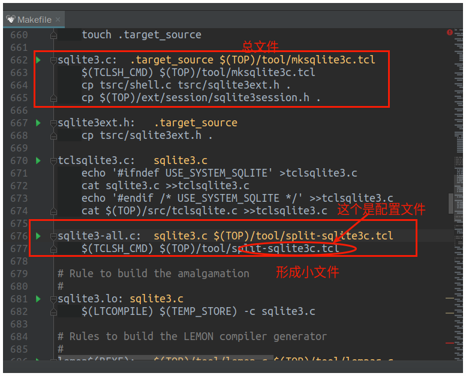
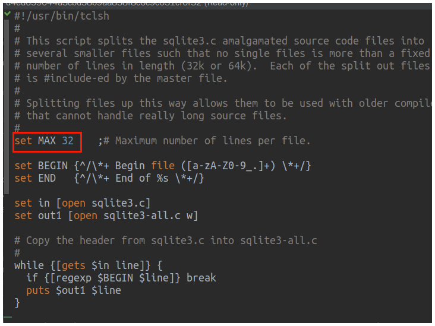

# 第一步
运行下面命令，生成config文件

    tar xzf sqlite.tar.gz    ;#  Unpack the source tree into "sqlite"
    mkdir bld                ;#  Build will occur in a sibling directory
    cd bld                   ;#  Change to the build directory
    ../sqlite/configure      ;#  Run the configure script
    make                     ;#  Run the makefile.
    make sqlite3.c           ;#  Build the "amalgamation" source file
    make test                ;#  Run some tests (requires Tcl)

## 查看生成的makefile
如果安装好makefile的插件，就能看到绿色的小箭头就说明可以运行

>sqlite3.c是生成一个总的源文件，大约有7万行，单个文件太大clion无法进行源码分析

>如果能把这些文件弄成小文件，就比较方便调试这个时候需要修改split-sqlite3c.tcl配置文件。调整MAX参数，生成小文件

>运行之后的文件是这样。。以数字命名的。也不方便调试。
