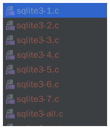
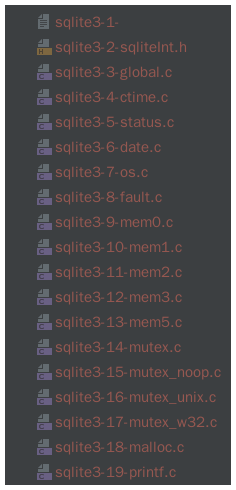

# 第一步
运行下面命令，生成config文件

    tar xzf sqlite.tar.gz    ;#  Unpack the source tree into "sqlite"
    mkdir bld                ;#  Build will occur in a sibling directory
    cd bld                   ;#  Change to the build directory
    ../sqlite/configure      ;#  Run the configure script
    make                     ;#  Run the makefile.
    make sqlite3.c           ;#  Build the "amalgamation" source file
    make test                ;#  Run some tests (requires Tcl)

## 查看生成的makefile
如果安装好makefile的插件，就能看到绿色的小箭头就说明可以运行

>sqlite3.c是生成一个总的源文件，大约有7万行，单个文件太大clion无法进行源码分析


>如果能把这些文件弄成小文件，就比较方便调试这个时候需要修改split-sqlite3c.tcl配置文件。调整MAX参数，生成小文件


>运行之后的文件是这样。。以数字命名的。很不方便阅读理解。。。


>稍微修改一下文件修改配置文件如下

```tcl
#!/usr/bin/tclsh
#
# This script splits the sqlite3.c amalgamated source code files into
# several smaller files such that no single files is more than a fixed
# number of lines in length (32k or 64k).  Each of the split out files
# is #include-ed by the master file.
#
# Splitting files up this way allows them to be used with older compilers
# that cannot handle really long source files.
#
set MAX 32    ;# Maximum number of lines per file.

set BEGIN {^/\*+ Begin file ([a-zA-Z0-9_.]+) \*+/}
set END   {^/\*+ End of %s \*+/}

set in [open sqlite3.c]
set out1 [open sqlite3-all.c w]

# Copy the header from sqlite3.c into sqlite3-all.c
#
while {[gets $in line]} {
  if {[regexp $BEGIN $line]} break
  puts $out1 $line
}

# Gather the complete content of a file into memory.  Store the
# content in $bufout.  Store the number of lines is $nout
#
proc gather_one_file {firstline bufout nout filena} {
  regexp $::BEGIN $firstline all filename
  puts $filename
  set end [format $::END $filename]
  upvar $bufout buf $nout n $filena fn
  set buf $firstline\n
  global in
  set n 0
  set fn $filename
  while {[gets $in line]>=0} {
    incr n
    append buf $line\n
    if {[regexp $end $line]} break
  }
}

# Write a big chunk of text in to an auxiliary file "sqlite3-NNN.c".
# Also add an appropriate #include to sqlite3-all.c
#
set filecnt 0
proc write_one_file {content filename} {
  global filecnt
  incr filecnt
  set out [open sqlite3-$filecnt-$filename w]
  puts -nonewline $out $content
  close $out
  puts $::out1 "#include \"sqlite3-$filecnt-$filename\""
}

# Continue reading input.  Store chunks in separate files and add
# the #includes to the main sqlite3-all.c file as necessary to reference
# the extra chunks.
#
set all {}
set N 0
set filename_temp {}
while {[regexp $BEGIN $line]} {
  set buf {}
  set n 0
  set fn {}
#  puts $line
  gather_one_file $line buf n fn
  if {$n+$N>=$MAX} {
    write_one_file $all $filename_temp
    set all {}
    set N 0
  }
  set filename_temp $fn
  append all $buf
  incr N $n
  while {[gets $in line]>=0} {
#    puts $line
    if {[regexp $BEGIN $line]} break
    puts $out1 $line
  }
}
if {$N>0} {
  write_one_file $all "the_last.c"
#   puts $N
}
close $out1
close $in
```

> 这样运行之后就可以以文件的形式运行


