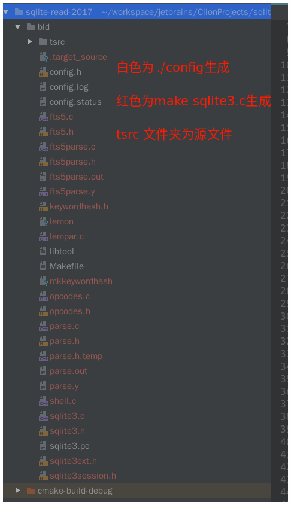
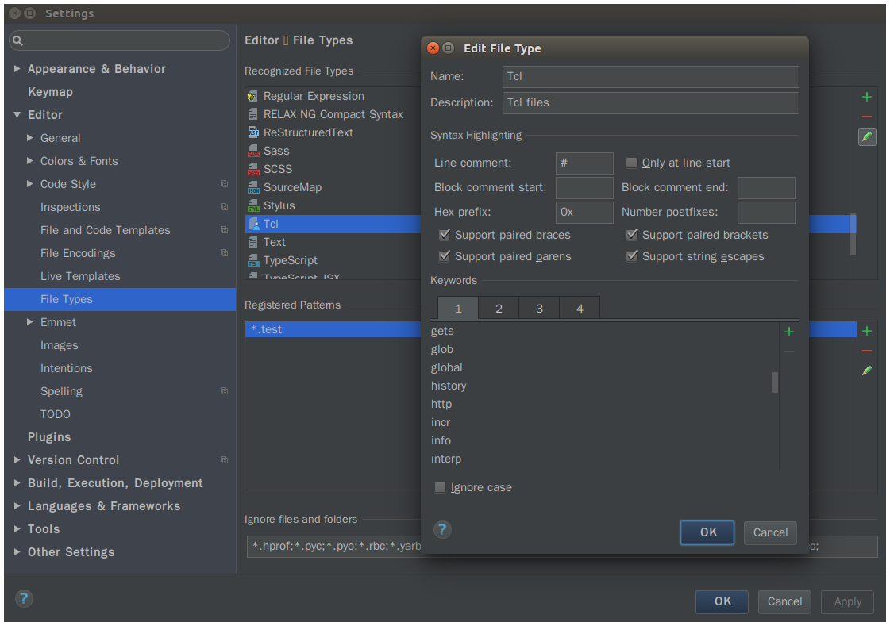

# 第一次配置

按照readme操作之后截图

>运行./config之后生成一些配置文件



clion配置tcl语法高亮功能



## makefile语法高亮
用clion的makefile插件


```bash
cat >config.log <<_ACEOF
This file contains any messages produced by compilers while
running configure, to aid debugging if configure makes a mistake.

It was created by sqlite $as_me 3.16.2, which was
generated by GNU Autoconf 2.69.  Invocation command line was

  $ $0 $@
_ACEOF #这个表示结束符，只要首尾一致即可
```

sliqte 用bash写的./config生成config文件，用make根据生成的config文件编译生成可执行文件
